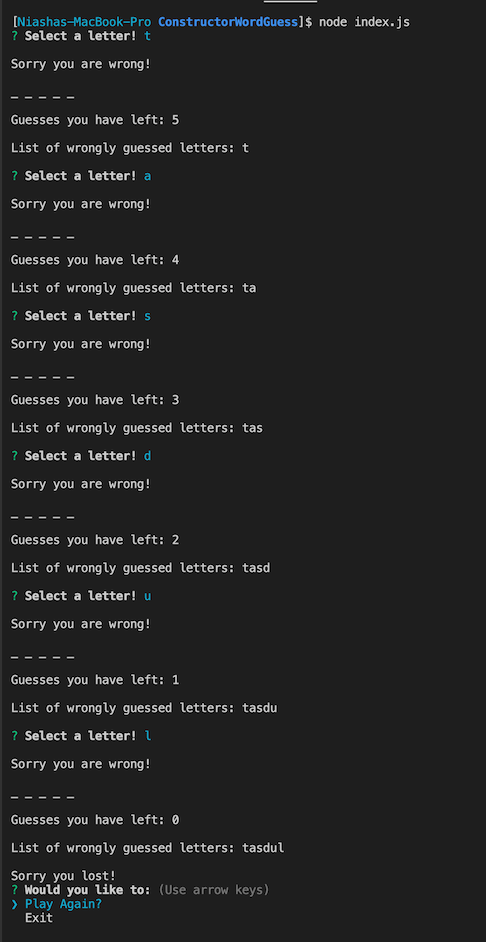
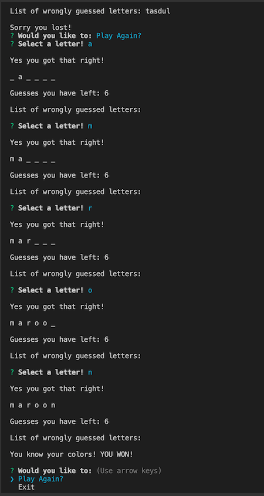
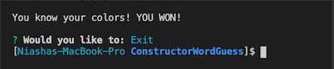
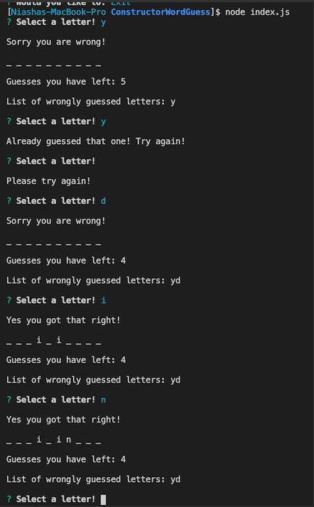

# ConstructorWordGuess

For this assignment, a Word Guess command-line game was created using constructor functions and inquirer-npm.

The different files needed to create the game:

- Letter.js file contains a constructor, Letter. This constructor displays an underlying character or a blank placeholder (such as an underscore), depending on whether or not the user has guessed the letter.

- Word.js file contains a constructor, Word that depends on the Letter constructor. This is used to create an object representing the current word the user is attempting to guess.

- Index.js file contains the logic for the course of the game, which depends on Word.js. It should randomly selects a word and uses the Word constructor to store it and prompts the user for each guess and keeps track of the user's remaining guesses.

## How Game Works:

### **Image One:**

This displays a round of a user guessing letters. The game keeps track of:

1. How many guesses the user has left.
1. The wrong letters the user has guessed.
1. Lets the user know the selection was wrong.
1. The _Game Over_ when the guesses run out.

   - This leads to the menu to either **Play again** or **Exit** the game.

1. The user decided to play again which carries on to the second image.

### **Image Two:**

This displays a round of a user guessing letters. The game keeps track of (but wanted to highlight some diffrences in this image):

- In addition to 1-4 listed for image one:

1. Displays the correct letters selected by the user and replaces the underscore with the correct corresponding letter.
1. Lets the user know the selection was correct.
1. The **Game Over** when the user has correctly guessed all the letters in the word before using all of the available guess.

### **Image Three:**

This displays image display the user selecting **Exit** out of the list options.

### **Image Four:**

Again this displays a round of a user guessing letters.

- This image is highlighting some additional functionality of the game:

  1. If the same letter is guess of nothing is guessed the user will be notified _Already guessed that one! Try again!_.
     - This will not lower guess count
